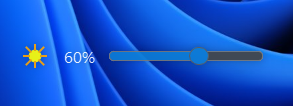

# Monitor Brightness Control

A Windows system tray application for controlling monitor brightness across multiple displays. Features a modern Windows 11-style UI with smooth animations and global hotkeys. The goal is to produce a mininalistic brightness slider similar to the one found on windows laptops.

## Showcase 




## Features

✨ Modern floating slider UI with animations  
🎮 Global hotkeys (Ctrl + Up/Down)  
🖥️ Multi-monitor support (Including external monitors! )
🚀 Auto-starts with Windows  
🎯 System tray integration  
⚙️ DDC/CI monitor control
👆 Click to drag slider

## Usage

- System Tray:
  - Left click: Show brightness slider
  - Right click: Menu options
- Keyboard:
  - `Ctrl + ↑`: Increase brightness
  - `Ctrl + ↓`: Decrease brightness

## Requirements

- Windows 10/11
- DDC/CI compatible monitors
- Administrator privileges

## Project Structure

- `monitor.py` - Main entry point for the application
- `modules.py` - Contains all the functionality and classes
- `installer.py` - GUI installer for the application
- `build_exe.py` - Script to build executable files

## Building Executable Files

This project includes a build script that uses PyInstaller to create executable files. The script provides several options for building the application.

### Prerequisites

- Python 3.6 or higher
- PyQt5 (`pip install pyqt5`)
- The build script will automatically install PyInstaller if it's not already installed

### Building the Application

To build the application executable, run the `build_exe.py` script:

```bash
python build_exe.py
```

This will create a directory-based executable in the `dist/MonitorBrightness` folder.

#### Build Options

The build script supports several command-line options:

- `--onefile` - Create a single executable file instead of a directory
- `--console` - Show console window when running (useful for debugging)
- `--installer` - Build the installer executable instead of the main application

Examples:

```bash
# Build a single executable file with no console
python build_exe.py --onefile

# Build with console window for debugging
python build_exe.py --console

# Build the installer executable
python build_exe.py --installer
```

### Output Locations

- Main application: `dist/MonitorBrightness/MonitorBrightness.exe` (or `dist/MonitorBrightness.exe` with `--onefile`)
- Installer: `dist/MonitorBrightnessInstaller.exe`

## Installation

You can either:

1. Run the installer executable (if built with `--installer` option)
2. Manually copy the application files to your desired location

### Using the Installer

The installer provides options to:
- Choose installation directory
- Add the application to Windows startup
- Create a desktop shortcut

### Manual Installation

If you prefer manual installation:
1. Copy the executable (or directory) to your desired location
2. Create shortcuts as needed
3. To add to startup, create a shortcut in `%APPDATA%\Microsoft\Windows\Start Menu\Programs\Startup`

## Download

- EXE version provided under dist folder
- Clone to build from source

### Technical Details
- Built with Python & PyQt5
- Uses DDC/CI protocol for monitor control
- Windows Registry integration for auto-start
- Smooth animations with QPropertyAnimation
- Efficient debounced brightness control

### Known Issues
- Could take up to 30 seconds to start again after a restart
- Some monitors may not support DDC/CI
- Reccommended to use HDMI as DP cables might face some issues 
- Requires admin privileges for first run
- May need manual startup addition on some systems

### License
- MIT License
